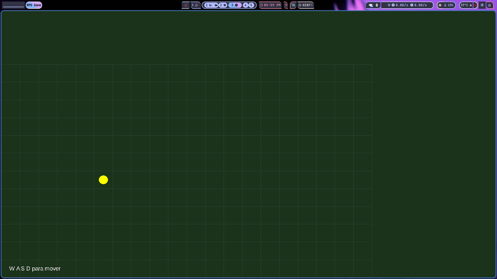
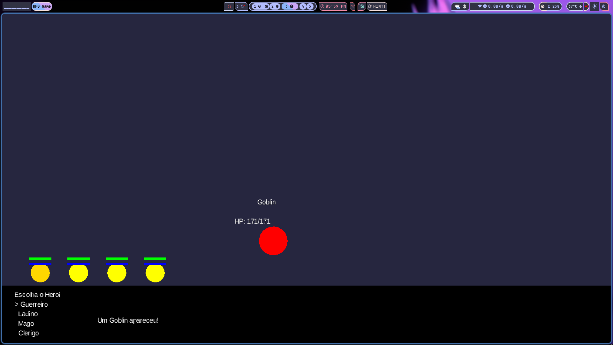
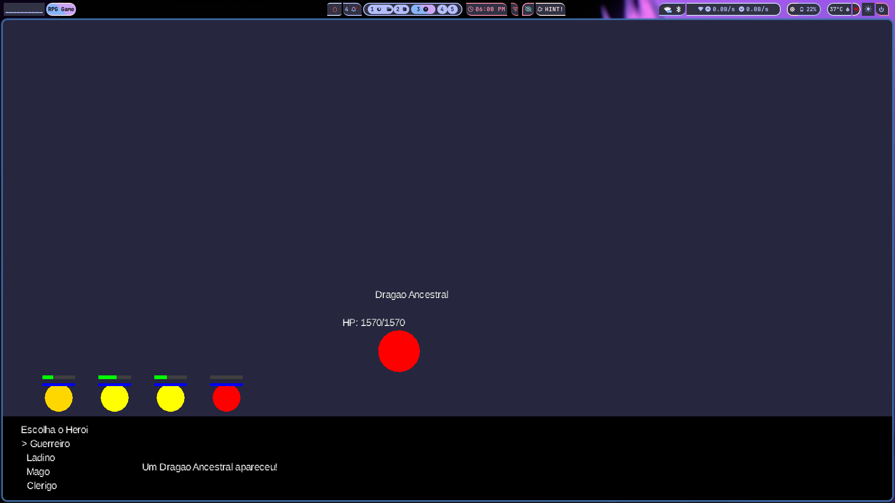
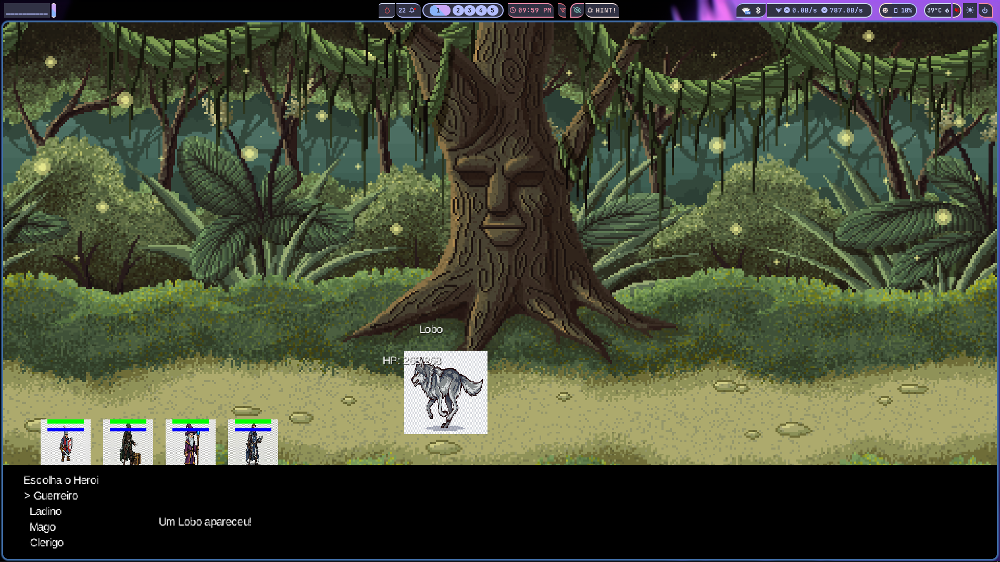
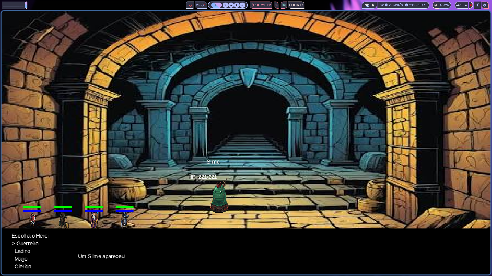
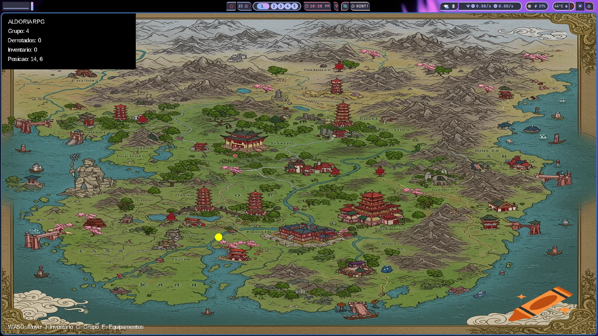

## INICIAL 
-> comecei gerando as classes iniciais de entidade, tudo isso dentro dos models do projeto 

-> na classe *HEROI* e na classe *PERSONAGEM* eu defini a base de codigo e clean code que segui no projeto 

### LOGICAS DE MUNDO 

-> configurei a ideia de inimigo e do mapa aonde inicialmente ele tem um grid em forma de matriz 2X2 que sera substituido
pelo mapa final 

-> com base neste grid os enimigos sao gerados randomicamente, são iniciados com vidas e ataques randomicos

-> sao gerados inicialmente 3 inimigos mais fracos e depois é gerado um inimigo mias forte (boss)

-> todos inimigos dropan loot para o gerenciameto de grupo 

-> a logica de itens, ataques e skills estao implementada, so esta faltando a config deimagens e refnamento de tela 
# PROCESSO DE DESENVOLVIMENTO 

comecei pela logica geral aonde defini como ia funcionar os personagens, depois o mapa e as telas,
as telas sao geradas em dois momentos

# DIFICULDADES
-> uma coisa que me fez quase perder o cabelo pensando foi que ospersonagesso faziam uma luta e depois nao entravam na tela, achei que era bug vizual e fui tentar resolver 
no final descobri q os personagens estavam mortos 
poe isso agora existe a barra visual de vida 
## TELA MAPA 

aonde o personagem (circulo amarelo)  ira andar pelo senario ate aleatoriamente achar um enimigo 

## TELA BATALHA 

tela de batalha oande pode ser escolhido qual persnage atacar e qual tipo de golpe ou skill usar, tambem serve como gerenciamento de itens 

tambem pode se ver nesta tela que o inimigo ataca os personagens podendo matar eles 

o personagem vermelho esta morto 

como atualização do projeto caminhando para a parte final de ajustes de imagem foi arrumado as separações de telas e sprit 
aonde a tela batalha acabou ficando bem hard-code, sinto que poderia ter melhorado a modularização, tentarei fazer isso durante estes dias finais
tambem adicionei imagens e sprits ao jogo, itoisso ODEIO QUEM DEIXA PNG FALSO NA INTERNET

consegui remover o fundo das imagens com ajuda da ferramenta de IA do canvas, e os pngs foram gerados pelo gemini 
levando em conta que tenho zero habilidades artisticas, os backgrounds foram pegos nos assets gratis da plataforma itchi.io 

## imagens do jogo quase finalizado 

### Batalha

ainda existe outros inimigos mas morri antes de chegar neles, pelo visto não sou bom joando meu proprio jogo

### Mapa

